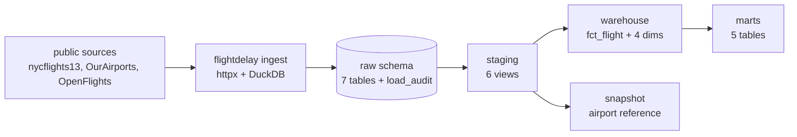

# flightdelay-dbt-warehouse

A dimensional warehouse for US flight delays, built with dbt on DuckDB.

The pipeline pulls the 2013 nycflights13 data plus two global aviation reference
files, loads them into a raw schema month by month, and then dbt turns that into
a star schema and five marts. Everything runs on one machine from a single
DuckDB file. There is no Docker, no server, and no cloud account.

I picked flight data because it has a natural star schema and enough real mess
in it to make the tests do actual work.

## Pipeline



## Sources

| Source | What it gives | Rows |
| --- | --- | --- |
| nycflights13 flights | every departure from EWR, JFK and LGA in 2013 | 336,776 |
| nycflights13 weather | hourly observations at the three origins | 26,115 |
| nycflights13 planes | aircraft reference by tail number | 3,322 |
| nycflights13 airlines | carrier code to name | 16 |
| nycflights13 airports | FAA airport reference | 1,458 |
| OurAirports | global airport reference, updated continuously | 86,013 |
| OpenFlights | global airline reference | 6,162 |

All seven are public, keyless and fetched over HTTPS at run time.

## Layers

The loader writes raw tables that match the source shape, one row per source row.
Flights and weather are loaded a month at a time: the loader deletes the month
then inserts it, so rerunning a month is safe and rerunning the whole year
changes nothing. Every load writes a row to `raw.load_audit`.

Staging renames columns, converts the four-digit clock fields to minutes past
midnight, nulls out impossible weather readings, and conforms airports and
carriers against the global references.

The warehouse layer is the star schema. `fct_flight` is one row per scheduled
departure, keyed on a surrogate key and joined to the hourly weather at its
origin. Around it sit `dim_date`, `dim_airport`, `dim_carrier` and
`dim_aircraft`. `fct_flight` is a dbt incremental model, so a rebuild only
touches new dates.

The marts answer the questions I actually wanted to ask: carrier performance,
route performance, weather impact, daily operations and aircraft utilization.

A dbt snapshot tracks the OurAirports reference with a check strategy. That
file changes upstream for real, so the snapshot picks up airports that get
renamed, reclassified or added.

## Running it

```
pip install -e ".[dev]"
flightdelay ingest
dbt build
```

`flightdelay ingest --months 2013-06` reloads a single month.
`flightdelay status` prints row counts and the last ten load audit rows.
`dbt docs generate` builds the lineage docs.

Everything tunable lives in `config.toml` and is validated on load, so a bad
month string or a plain HTTP url fails immediately instead of halfway through.

## Tests

`dbt build` runs 106 data tests as part of the DAG, so a broken model stops
everything downstream of it. Alongside the usual unique and not null tests
there are two generic tests I wrote, `non_negative` and `within_range`, plus
relationship tests on every foreign key in the fact table and three singular
tests that check the fact row count still matches the source, that cancelled
flights carry no arrival times, and that the weather join covers at least
99 percent of flights.

The Python side has 35 pytest tests. They run against a fake registry built on
`httpx.MockTransport`, so the suite needs no network and no downloaded files.

`ruff` and `sqlfluff` both run clean. GitHub Actions runs the linters and pytest
on Python 3.11, 3.12 and 3.13, then runs the real pipeline end to end against
the live sources and asserts that a second build changes nothing.

## What the data shows

Delay compounds through the day. Only 7.4 percent of departures scheduled for
6am leave more than fifteen minutes late, averaging 1.6 minutes of delay. By
9pm that is 35.8 percent and 24.2 minutes. The morning starts clean and the
day never recovers.

Weather hits cancellations harder than it hits delays.

| Condition | Flights | Cancelled | Delayed | Avg delay |
| --- | --- | --- | --- | --- |
| No precipitation | 312,218 | 2.02% | 19.91% | 11.4 min |
| Heavy precipitation | 1,783 | 7.91% | 44.48% | 40.5 min |
| Visibility 10 miles or more | 278,739 | 1.82% | 19.72% | 11.0 min |
| Visibility under 1 mile | 3,975 | 8.93% | 29.71% | 29.7 min |
| Wind under 10 mph | 149,178 | 1.94% | 19.17% | 11.0 min |
| Wind 30 mph or more | 993 | 10.27% | 29.71% | 28.0 min |

The two worst days in the year are 8 and 9 February. LaGuardia cancelled
65.9 percent of its departures on the 9th, Newark 57.6 percent, and JFK
52.3 percent on the 8th. That is the February 2013 blizzard showing up in the
data without anyone telling the pipeline about it.

Holidays are calmer, not busier. On the ten US federal holidays 17.0 percent of
departures ran late against 20.6 percent on other days, and cancellations were
1.24 percent against 2.46 percent.

Carriers differ more than I expected. Alaska arrives late on 14.3 percent of
flights and averages 9.9 minutes early. Frontier is late on 37.1 percent. The
gap is not only departure discipline: Alaska makes up 15.8 minutes in the air on
an average flight and Virgin America 11.0, while Frontier loses another 1.7.

## Things that went wrong

DuckDB's `/` is true division, so my first conversion of `sched_dep_time` to
minutes produced 324 instead of 315 for a 5:15 departure. I only caught it
because the `within_range` test on the result failed with 963 rows over 1439.
That test existed because the column looked too obvious to get wrong.

The Rdatasets export writes missing values as empty strings, not `NA`. I set
`nullstr = "NA"` on the reader out of habit, which stopped DuckDB treating the
empty strings as null, so `dep_delay` and `arr_delay` came in as text. Dropping
the setting fixed the types.

Naming the database file `warehouse.duckdb` made the catalog name collide with
the `warehouse` schema, and every qualified reference became ambiguous. The file
is now `flightdelay.duckdb`.

Four destinations in the flight data, SJU, BQN, PSE and STT, are missing from
the FAA airport list that ships with nycflights13. Without handling them the
fact table has destination keys pointing at nothing. `dim_airport` now fills
them from OurAirports and records where each row came from: 1,214 airports
matched by IATA code, 164 by local code, 80 exist only in the FAA list and 4
only in the global reference.

`dep_time` and `arr_time` use 2400 for midnight, which is 179 rows across the
year and breaks a plain modulo conversion.

721 of the 4,043 tail numbers that actually flew have no row in the aircraft
reference. `dim_aircraft` keeps them with a flag rather than dropping the
flights.

## Numbers

Measured on my laptop, an HP OmniBook 5 with 8 GB of RAM, Python 3.13.

| Step | Time |
| --- | --- |
| Ingest, files already downloaded | 13.8 s |
| dbt build, 124 nodes | 5.49 s |
| pytest, 35 tests | 13.1 s |

The sources are 48 MB of CSV. The finished DuckDB file is 36 MB and holds
459,862 raw rows, 336,776 fact rows, 224 routes, 4,043 aircraft and a 365 day
date dimension. 8,255 flights were cancelled and 1,175 diverted. The weather
join covers 99.53 percent of flights.
